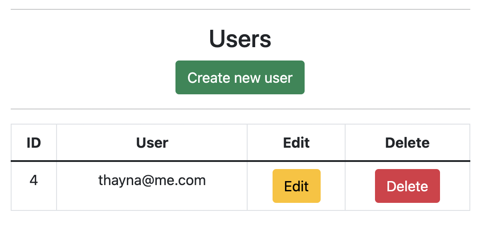
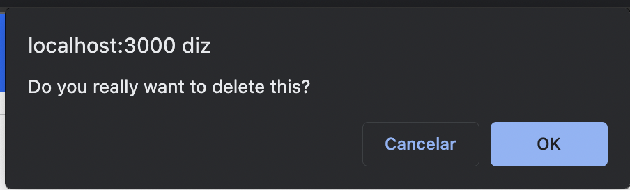

# Blog

## Overview
The main purpose of this project is to build a webpage to create, edit, delete and relate articles with its category. The application provides knowledge about my studies on `Node.js`, `EJS` and `MySQL`.

  

  

## Libraries 

- Bcrypt => Crypt passwords;
- Dotenv => Hide keys;
- EJS => Render HTML;
- Express => Flexible framework;
- Express-sessions => Create auth sessions;
- TinyMCE => Text editor;
- Sequelize => Connect database;
- Slugify => Create string without space;

## Configuring database

1. As we use MySQL to build our data base, you can download it at this link if you don't have it already: 
`https://dev.mysql.com/downloads/mysql/ ` 
2. Download `MySQL Workbench` at `https://www.mysql.com/products/workbench/`

3. After installing `WorkBench` click on `MySQL Connections`:

4. Then go on the top of the page and click on `Create new schema`

5. The name of the `new_schema` must be `blog`

6. Add `.env` file into main folder, and put:

    - `DATABASE_PASSWORD = YourPassword`
    - `DATABASE_USER = root`
    - `DATABASE_TABLE = blog`
    - `DATABASE_HOST = localhost`
    - `DATABASE_DIALECT = mysql`
    - `DATABASE_TIMEZONE = -03:00`
    - `SESSION_SECRET = passwordSecret`

## Running the application

- Run: `npm install`;
- Run: `nodemon index.js`;
- On web browser: http://localhost:3000/

## Screen shots

- Navbar shows categories from database;

  

  

- Mainpage brings two buttons to register or login;

  

  

- Create your account at the blog;

  

  

- After you create your account, you can login;

  

  

- The navbar will change;

  

  

- When you create a new article it'll show as below;

  

  

- When you create a new category it'll show as below;

  

  

- All users will show as below;

  

  

- All categories will show as below;

  

  

- All articles will show as below;

  

  

- Whenever you try to delete something from database, the message below pops up;

  

  

- If you click on edit file, the body information will be showed at the form;

  

  

- All articles created will be shown at the index page. If more than 4, there will be a `next`page;

  

  

- Also a `previous`page;

  

  

## Licenses
 

    

    

